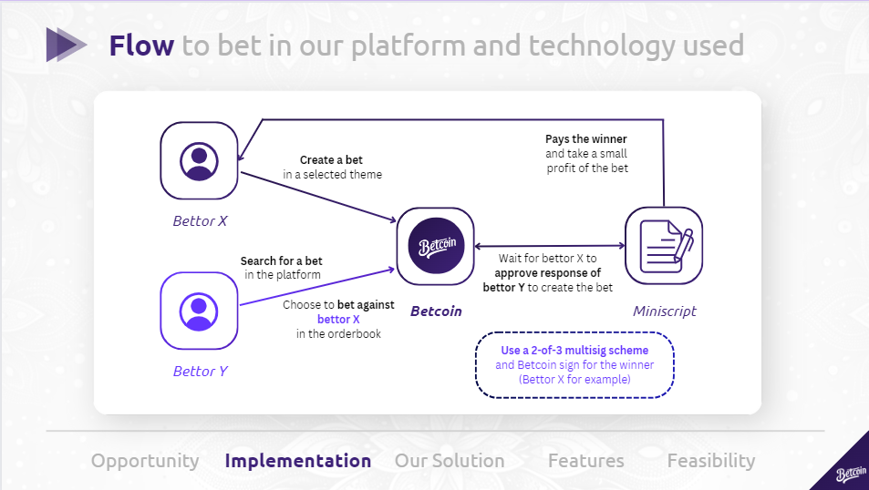
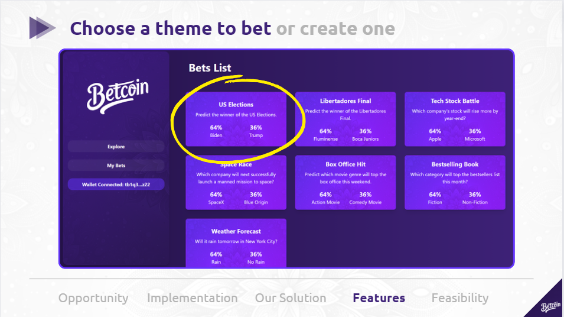
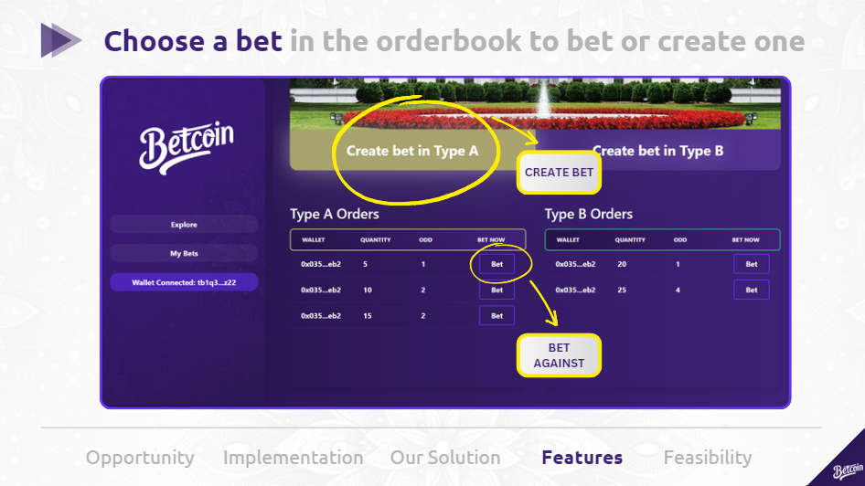

# Betcoin - SatsHack 2023

## Bitcoin Bet Platform

Betcoin is a betting platform to users bet using Bitcoin in a multisig-2-in-3 format, it is a secure, descentralized and funny way to bet against friends and others about any topic that has 2 unique possible outcomes.

## The Idea

This project uses a DLC multisig-2-in-3 scheme, basically implemented using Miniscript, a technology that allow the platform to perform the bets using Bitcoin. The ideia is like an original betting platform in a way that is possible to bet in any theme (users can create one) and against other people, based in a orderbook, the features and implementationsn are listed in this ReadMe file and the presentation in the presentation folder.

___

## User Roles

### Bettors

Features:

- *Bet Theme:* Can choose a theme to bet (/ route)
- *Bet Against Option:* Can choose to bet against other person in the platform's orderbook (/bet/id route)
- *Create Bet:* Can create a bet to people bet against it (/createbet/id/option route)
- *Create Theme:* Can create a theme to make people bet against each other (/createtheme route) + (pivoted: not implement in the hackathon)

## How it Works

Functionality:

Choose theme screen:

Create bet or bet against screen:

### Technology

- Frontend: We used react.js + tailwind css to adjust our project
- Backend: We used Node.js with the tecnologies associated with Bitcoin

### Folder Structure

Here is the folder structure of the project with comments about files:

    .
    ├── README.md                                        
    ├── presentation/                                    # Directory where the presentation is
    ├── frontend/                                        # Directory for frontend using Typescript + Tailwind CSS + Vite JS
    │     └── src/                                       
    │          ├── App.tsx                               # Main application component
    │          ├── assets/                               
    │          ├── components/                          
    │          │      ├── Orderbook/                     # Component to demo orderbook
    │          │      ├── Header/                        
    │          └── pages/                                
    │                 ├── Home/                          # Home: Page where the bet themes are displayed
    │                 ├── CreateBet/                     
    │                 ├── CreateTheme/                   
    │                 ├── Bet/                           # Bet: Location of orderbook and option to create bet
    │                 ├── Layout/                        # Layout page to incorporate header in the app
    │                 ├── MyBets/                        # Bashboard to see status of user bets
    │                 └── SuccessBet/                    # Page component to display bet success
    │
    └── backend/                                         # Directory for the backend API connection Bitcoin multisig-2-in-3
          └── src/

## Implemented Solution

### How to run locally steps

You need to run in the frontend:

npm install

Then run the project with:

npm run start

## Team

Bryan Borck (developer/designer)

Luiz Vasconcelos (blockchain developer)

Daniel Yuki (developer)
